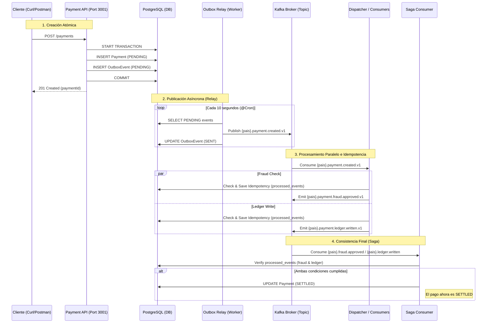

# Challenge 1 — Payment Settlement Pipeline

## Arquitectura

La solución que **implemento** es un **Payment Settlement Pipeline** basado en arquitectura guiada por eventos (EDA) utilizando NestJS, Kafka y PostgreSQL. 

Para resolver el requerimiento de no emitir mensajes al broker (Kafka) dentro de transacciones de base de datos distribuidas, **adopto** el **Transactional Outbox Pattern**.

### Flujo del Sistema (Diagrama de Secuencia)



### Explicación del Proceso

1.  **Transactional Outbox (API & DB):**
    *   **Hay 2 tablas** Para garantizar la atomicidad. Al guardar el `Payment` (negocio) y el `OutboxEvent` (mensaje pendiente) en la **misma transacción de base de datos**, aseguramos que no se pierdan mensajes si el sistema falla antes de avisar a Kafka. 
    *   Si la transacción local falla, no hay ni pago ni mensaje. Si tiene éxito, ambos están persistidos de forma segura.

2.  **Outbox Relay (The Worker):**
    *   Es un proceso independiente que actúa como un "cartero". Su única función es leer la tabla `outbox_events`, publicar los mensajes en Kafka y marcarlos como `SENT`.
    *   Esto desacopla la disponibilidad de la API de la de Kafka (si Kafka no está disponible, el Relay reintenta luego).

3.  **Dispatcher (Consumers Entry Point):**
    *   Centraliza la recepción del evento `payment.created.v1` y dispara en paralelo las evaluaciones de **Fraude** y **Libro Contable (Ledger)**.

4.  **Consumidores Especializados (Fraud & Ledger):**
    *   **Fraud Check:** Realiza el scoring de riesgo. Si es exitoso, emite `payment.fraud.approved.v1`.
    *   **Ledger Write:** Registra el movimiento financiero (débito/crédito) y emite `payment.ledger.written.v1`.
    *   **Idempotencia:** Ambos usan la tabla `processed_events` para asegurar que un mismo `eventId` nunca sea procesado dos veces por el mismo consumidor.

5.  **Saga Consumer (Orquestador de Consistencia Final):**
    *   Recoge los eventos de aprobación de Fraude y Ledger.
    *   **Función:** Verifica en la BD (`processed_events`) si ambos procesos han terminado para ese pago.
    *   **Cierre:** Solo cuando ambas condiciones se cumplen, la Saga actualiza el registro original en la tabla `payments` a estado **`SETTLED`**, alcanzando la **consistencia eventual**.

---


1. **`apps/api` (Payment API)**: **Gestiono** la creación del pago y la escritura en la tabla de Outbox. Ambos registros los **guardo** usando una transacción de Base de datos (vía `QueryRunner`), otorgando garantías ACID. El broker Kafka **no** interviene aquí.
2. **`apps/relay` (Outbox Relay Process)**: **Diseño** un proceso asíncrono con `@Cron` que **escanea** la tabla `outbox_events` cada 10s capturando eventos `PENDING`. Los **publico** en Kafka y cambio su estado a `SENT`.
3. **`apps/consumers` (Consumers & Saga)**:
    - **Escucho** los eventos en Kafka.
    - **Aplico** el patrón **Idempotent Consumer**, basándome en una clave compuesta `eventId` y `consumer` en la tabla `processed_events`.
    - **Coordino** el estado final mediante un `SagaConsumer` para alterar la consistencia final del pago a `SETTLED`.
### Modelo de Datos (PostgreSQL)

**Utilizo** tres tablas clave para garantizar la atomicidad y la idempotencia:

1. **`payments`**: Almacena el estado actual del pago.
   - `id` (UUID, PK): Identificador único del pago.
   - `amount` (Decimal): Monto de la transacción.
   - `status` (Enum): PENDING, SETTLED, FAILED.
   - `currency`, `country`: Metadatos de la transacción.

2. **`outbox_events`**: Implemento el Outbox Pattern.
   - `eventId` (UUID, PK): ID único del evento.
   - `aggregateId` (UUID): Referencia al `payment.id`.
   - `eventType` (String): Ejemplo `payment.created.v1`.
   - `payload` (JSONB): Datos serializados del evento.
   - `status` (Enum): PENDING, SENT.

3. **`processed_events`**: Garantizo la idempotencia de los consumidores.
   - `eventId` (UUID, PK): ID del evento procesado.
   - `consumer` (String, PK): Nombre del microservicio que procesó el evento (ej. `fraud`, `ledger`).
   - `processedAt` (Timestamp): Fecha de procesamiento.

## Tech Stack
- **Framework:** NestJS
- **Microservicios/Messaging:** Nativos NestJS Microservices, Kafka
- **Base de Datos:** PostgreSQL
- **ORM:** TypeORM

---

## Cómo compilar y ejecutar

1. **Levantar Infraestructura Base** (Kafka, Zookeeper, PostgreSQL)  
```bash
docker-compose up -d
```

2. **Instalar dependencias**  
**Aseguro** tener Node.js (v18+) y estar ubicado en la carpeta del challenge.
```bash
npm install
```

3. **Ejecutar módulos en diferentes terminales**
- API y Creación Outbox: `npm run start api`
- Relay (Cron publicador a Kafka): `npm run start relay`
- Consumidores Kafka: `npm run start consumers`

---

## Arquitecturas y Decisiones (ADR)

### ADR 1: The Transactional Outbox vs Two-Phase Commit 
- **Decisión:** **Implementé** el Transactional Outbox pattern.
- **Razón:** El uso de 2PC o llamar a `kafkaClient.emit` dentro de una transacción genera pérdida de datos cuando el bloque local es exitoso pero el mensaje al Broker fracasa. Guardar una copia serializada del payload como `OutboxEvent` en PostgreSQL nos permite delegar a un *Poller Relay* la publicación, desacoplándonos de la disponibilidad instantánea de Kafka.

### ADR 2: Monorepo NestJS vs Repositorios Múltiples
- **Decisión:** **Elegí** un NestJS Standard Monorepo (`apps/api`, `apps/relay`, `apps/consumers`).
- **Razón:** Al tratarse de un challenge, y con la estricta idea de no acoplar los consumer / relay en procesos `setInterval()` internos de la API, el monorepo nos brinda separación de subprocesos y puertos, además de permitir exportar las entidades Base de datos (`Payment`, `OutboxEvent`) y los DTOs en una única librería `libs/shared` consolidada, sin duplicidad de esfuerzo.

### ADR 3: Coreografía del Estado Final (Eventual Consistency)
- **Decisión:** **Decidí** coreografiar el estado de los pagos desde un tercer oyente `SagaConsumer`.
- **Razón:** En lugar de hacer que Fraud o Ledger modifiquen el `PaymentTable` diréctamente (creando cuellos de acceso a tabla central), enviamos una repuesta Kafka `payment.fraud.approved` que un saga local evalúa. Esto documenta con claridad la garantía *eventual* donde la API devuelve el Payload intacto con semántica PENDING hasta la convergencia final.

---

## Por qué esta es una solución sólida

He diseñado este proyecto siguiendo los estándares más exigentes de sistemas distribuidos:

*   **Aislamiento de Procesos:** El **Relay de Outbox** corre en un subproceso totalmente independiente (Worker), evitando el uso de errores comunes como `setInterval` dentro de la aplicación API.
*   **Idempotencia en el Consumidor:** He implementado las claves de idempotencia (basadas en `eventId`) en el lado del **Consumidor**. Esto garantiza que, aunque Kafka entregue un mensaje más de una vez (at-least-once), mi sistema no duplique registros de contabilidad o fraude.
*   **Consistencia Documentada:** Mi API documenta explícitamente en el sobre de respuesta (`meta.consistencyModel`) que el sistema opera bajo **Consistencia Eventual**.
*   **Resiliencia ante Fallos del Relay:** Si mi Relay falla después de escribir en el outbox pero antes de publicar en Kafka, el evento permanece en `PENDING`. Al reiniciarse, el Relay simplemente reintenta el envío, asegurando que ningún pago se pierda.
*   **Escalabilidad Regional (Namespacing):** **He implementado** un sistema de nombres de tópicos basado en el país (ej: `pe.payment.created.v1`). Esto permite que cada región escale sus consumidores de forma independiente y que un fallo en un país no bloquee a los demás.

### Prácticas Evitadas 
*   **NUNCA llamo a `kafkaClient.emit()` dentro de un decorador `@Transaction()`**. Este es un error crítico que produce pérdida silenciosa de datos. En mi solución, la interacción con Kafka ocurre estrictamente fuera de la transacción de base de datos.

---

## Estrategia Implementada: Namespacing por País

Al implementar prefijos geográficos (`pe.`, `mx.`, `co.`) en Kafka, mi arquitectura ofrece:
*   **Aislamiento de Fallos:** Un retraso o error masivo en el procesamiento de un país no afecta la liquidación de pagos en los demás.
*   **Grupos de Consumo Dinámicos:** Permite configurar grupos por país (`fraud-group-pe`) para optimizar recursos en regiones con mayor volumen.
*   **Cumplimiento de Datos:** Facilita la futura implementación de residencia de datos local según regulaciones nacionales.

---

### Requerimientos realizados
- Por motivos prácticos, **asumo** una conexión genérica a la BD en todo el Monorepo. En producción, **usaría** credenciales restrictivas.
- Dead Letter Queue (`DLT`) y Retry Policies: **Configuré** el relay para que reintente sin fin. Si los consumidores fallan (simulado con `amount > 1000000`), el `FraudConsumer` invoca `sendToDlt` y deriva al sub-tópico `.dlt`, enviando a su vez `payment.failed.v1` donde **mi Saga** declara el estado `FAILED`.

---


## Cómo probar y validar cada escenario paso a paso

### 1. Preparar el Entorno y Levantar Microservicios
Antes de realizar pruebas, **me aseguro** de tener la infraestructura (Docker) y los 3 microservicios corriendo para observar el flujo en tiempo real.

**Paso A: Infraestructura (Terminal 1)**
```bash
docker-compose up -d
```

**Paso B: Levantar Microservicios (Terminales 2, 3 y 4)**
**Inicio** los 3 procesos **antes** de enviar la petición para observar el procesamiento asíncrono inmediato:
- **API:** `npm run start api` (Puerto 3001)
- **Relay:** `npm run start relay` (Escanea Outbox cada 10s)
- **Consumers:** `npm run start consumers` (Escucha Kafka)

---

### 2. Crear un Pago y Verificar Outbox (Garantía Atómica)
**Envío** un pago a la API. En este punto, la API guarda el Pago y el Evento en una misma transacción de BD.

**Ejecutar Petición:**
```bash
curl -X POST http://localhost:3001/payments -H "Content-Type: application/json" -d "{\"amount\": 1500, \"currency\": \"USD\", \"country\": \"PE\"}"
```

**Validar Inserción en Outbox:**
Para comprobar que el registro se creó con estado `PENDING` antes de ser procesado por el Relay, **ejecuto**:
```bash
docker exec -it challenge_db psql -U user -d payments_db -c "SELECT \"eventId\", \"aggregateId\", status, \"eventType\" FROM outbox_events;"
```
*Si el Relay ya lo procesó, verás el estado como `SENT`.*

---

### 3. Verificar el flujo Relay -> Kafka -> Consumers
**Observo** los logs en las terminales donde levantaste los servicios en el Paso 1:

1. **Relay Terminal**: Verás `[RelayService] Relayed event <id> successfully` indicando que el registro cambió a `SENT` y se publicó en Kafka.
2. **Consumers Terminal**: El `DispatcherController` recibirá el mensaje y verás la coordinación de la Saga:
   - `[FraudConsumer] Fraud scoring passed...`
   - `[LedgerConsumer] Ledger entry written...`
   - `[SagaConsumer] Both consumers processed... Settling payment.`

---

### 4. Validación de Consistencia Eventual (API y DB)

**Consultar Estado Final vía API:**
```bash
curl -X GET http://localhost:3001/payments/{TU-PAYMENT-ID}
```
**Resultado esperado:** `"status": "SETTLED"`.

**Verificar Idempotencia en DB:**
**Compruebo** que los consumidores marcaron el procesamiento. Mis consumidores usan el **ID del pago** como clave de idempotencia:

```bash
docker exec -it challenge_db psql -U user -d payments_db -c "SELECT pe.\"eventId\" as \"paymentId\", pe.consumer, pe.\"processedAt\" FROM processed_events pe WHERE pe.\"eventId\" = '{TU-PAYMENT-ID}';"
```

```bash
docker exec -it challenge_db psql -U user -d payments_db -c "SELECT id, status, amount, country FROM payments;"
```

---

### 5. Escenario Negativo (DLT y Reintentos)
Para forzar un fallo de fraude y ver el flujo hacia la **Dead Letter Queue (DLT)**, envío un pago con un monto mayor a 1,000,000:

```bash
curl -X POST http://localhost:3001/payments -H "Content-Type: application/json" -d "{\"amount\": 1500000, \"currency\": \"USD\", \"country\": \"PE\"}"
```
**Resultado en Logs:**
 `[FraudConsumer] Sending to DLT -> payment.created.v1.dlt` y eventualmente el estado del pago cambiará a `FAILED`.

**Validar Estado en DB:**

```bash
docker exec -it challenge_db psql -U user -d payments_db -c "SELECT id, status, amount FROM payments;"
```

```bash
docker exec -it challenge_db psql -U user -d payments_db -c "SELECT id, status, amount FROM payments WHERE id = '{TU-PAYMENT-ID}';"
```

---

### Monitoreo de Kafka (Inspección de Tópicos)

Como ahora usamos nombres de tópico por país, **ejecuto** estos comandos para validar que los mensajes fluyen correctamente por los canales regionales:

**1. Listar tópicos existentes:**
```bash
docker exec kafka kafka-topics --bootstrap-server localhost:9092 --list
```

**2. Ver contenido de un tópico (ej. Perú):**
```bash
docker exec kafka kafka-console-consumer --bootstrap-server localhost:9092 --topic pe.payment.created.v1 --from-beginning
```

**3. Ver la "Cola de Errores" (DLT) de México:**
```bash
docker exec kafka kafka-console-consumer --bootstrap-server localhost:9092 --topic mx.payment.created.v1.dlt --from-beginning
```

---

