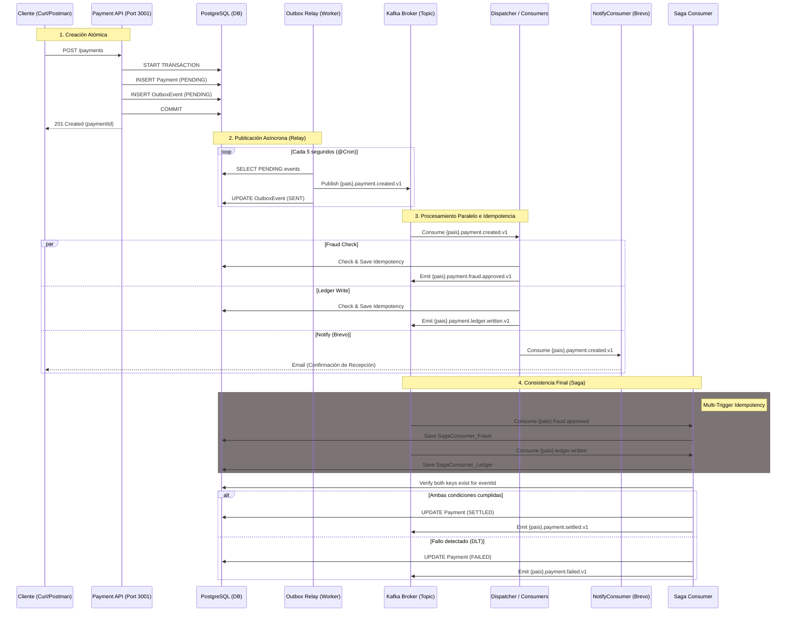
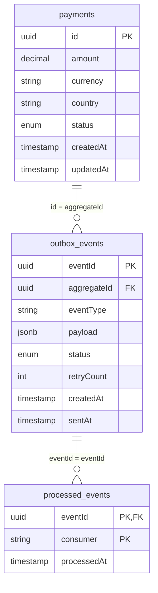
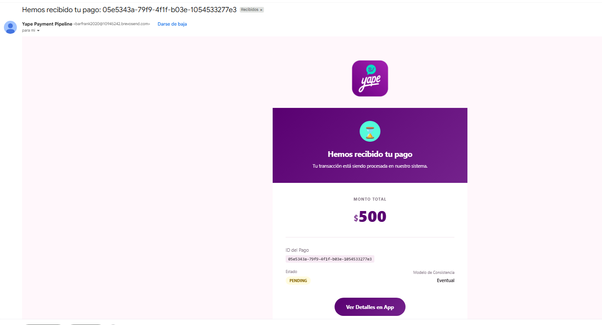

# Challenge 1 — Payment Settlement Pipeline

## Arquitectura

La solución que **implemento** es un **Payment Settlement Pipeline** basado en arquitectura guiada por eventos (EDA) utilizando NestJS, Kafka y PostgreSQL. 

Para resolver el requerimiento de no emitir mensajes al broker (Kafka) dentro de transacciones de base de datos distribuidas, **adopto** el **Transactional Outbox Pattern**.

### Flujo del Sistema (Diagrama de Secuencia)



### Explicación del Proceso

1.  **Transactional Outbox (API & DB):**
    *   **Hay 2 tablas** Para garantizar la atomicidad. Al guardar el `Payment` (negocio) y el `OutboxEvent` (mensaje pendiente) en la **misma transacción de base de datos**, aseguramos que no se pierdan mensajes si el sistema falla antes de avisar a Kafka. 
    *   Si la transacción local falla, no hay ni pago ni mensaje. Si tiene éxito, ambos están persistidos de forma segura.

2.  **Outbox Relay (The Worker):**
    *   Es un proceso independiente que actúa como un "cartero". Su única función es leer la tabla `outbox_events`, publicar los mensajes en Kafka y marcarlos como `SENT`.
    *   Esto desacopla la disponibilidad de la API de la de Kafka (si Kafka no está disponible, el Relay reintenta luego).

3.  **Dispatcher (Consumers Entry Point):**
    *   Centraliza la recepción del evento `payment.created.v1` y dispara en paralelo las evaluaciones de **Fraude** y **Libro Contable (Ledger)**.

4.  **Consumidores Especializados (Fraud, Ledger & Notify):**
    *   **Fraud Check:** Realiza el scoring de riesgo. Si es exitoso, emite `payment.fraud.approved.v1`.
    *   **Ledger Write:** Registra el movimiento financiero (débito/crédito) y emite `payment.ledger.written.v1`.
    *   **Notify (Brevo):** Escucha el evento inicial de creación (`payment.created.v1`) y envía una confirmación de recepción inmediata al usuario (`barfrank2020@gmail.com`) utilizando plantillas HTML personalizadas.
    *   **Idempotencia:** Todos usan la tabla `processed_events` para asegurar que un mismo `eventId` nunca sea procesado dos veces.

5.  **Saga Consumer (Orquestador de Consistencia Final):**
    *   **Garantía Multi-Evento:** Recoge confirmaciones de Fraude y Ledger. Como son eventos distintos en Kafka, utiliza una arquitectura de **idempotencia granular**:
        *   `SagaConsumer_Fraud`: Registra que el mensaje de aprobación de fraude fue procesado por la Saga.
        *   `SagaConsumer_Ledger`: Registra que el mensaje de escritura en libro contable fue procesado por la Saga.
    *   **Cierre Exitoso:** Cuando ambas llaves existen para el mismo `eventId` original, actualiza el pago a **`SETTLED`** y emite **`payment.settled.v1`**.
    *   **Cierre Fallido:** Si recibe un evento de fallo (marcado como `SagaConsumer_Failed`), actualiza el pago a **`FAILED`** y emite **`payment.failed.v1`** de forma atómica.

---


1. **`apps/api` (Payment API)**: **Gestiono** la creación del pago y la escritura en la tabla de Outbox. Ambos registros los **guardo** usando una transacción de Base de datos (vía `QueryRunner`), otorgando garantías ACID. El broker Kafka **no** interviene aquí.
2. **`apps/relay` (Outbox Relay Process)**: **Diseño** un proceso asíncrono con `@Cron` que **escanea** la tabla `outbox_events` cada 10s capturando eventos `PENDING`. Los **publico** en Kafka y cambio su estado a `SENT`.
3. **`apps/consumers` (Consumers & Saga)**:
    - **Escucho** los eventos en Kafka.
    - **Aplico** el patrón **Idempotent Consumer**, basándome en una clave compuesta `eventId` y `consumer` en la tabla `processed_events`.
    - **Coordino** el estado final mediante un `SagaConsumer` para alterar la consistencia final del pago a `SETTLED`.
### Modelo de Datos (PostgreSQL)



**Utilizo** tres tablas clave para garantizar la atomicidad y la idempotencia:

1. **`payments`**: Almacena el estado actual del pago.
   - `id` (UUID, PK): Identificador único del pago generado al momento de la creación.
   - `amount` (Decimal): Monto numérico de la transacción.
   - `currency` (String): Moneda del pago (ej. USD, PEN).
   - `country` (String): Código del país para el ruteo de eventos (ej. PE, MX).
   - `status` (Enum): Estado actual del ciclo de vida (`PENDING`, `SETTLED`, `FAILED`).
   - `createdAt` (Timestamp): Fecha de creación del registro.
   - `updatedAt` (Timestamp): Última vez que se actualizó el registro (útil para auditoría de cambios de estado).

2. **`outbox_events`**: Implemento el Outbox Pattern.
   - `eventId` (UUID, PK): Identificador único del evento para rastreo global.
   - `aggregateId` (UUID): Referencia al ID del pago (`payment.id`) que originó el evento.
   - `eventType` (String): El tipo de evento para despacho (ej. `payment.created.v1`).
   - `payload` (JSONB): El cuerpo completo del mensaje serializado que será enviado a Kafka.
   - `status` (Enum): Estado del envío por parte del Relay (`PENDING`, `SENT`, `FAILED`).
   - `retryCount` (Int): Contador de intentos fallidos de publicación por el proceso Relay.
   - `createdAt` (Timestamp): Momento en que el evento fue insertado en la tabla.
   - `sentAt` (Timestamp): Momento exacto en que el Relay confirmó la publicación en el broker de Kafka.

3. **`processed_events`**: Garantizo la idempotencia de los consumidores.
   - `eventId` (UUID, PK): ID del evento capturado desde Kafka (proviene de `outbox_events.eventId`).
   - `consumer` (String, PK): Nombre del microservicio o lógica que procesó el evento (ej. `FraudConsumer`).
   - `processedAt` (Timestamp): Registro de tiempo para control y auditoría de la idempotencia.

## Tech Stack
- **Framework:** NestJS
- **Microservicios/Messaging:** Nativos NestJS Microservices, Kafka
- **Base de Datos:** PostgreSQL
- **ORM:** TypeORM

## Mejoras en el API Rest (Robustez y Seguridad)

Como parte de la evolución de la plataforma, **he implementado** una serie de capas de seguridad y optimización para asegurar que la API sea de grado producción:

1.  **Validación Estricta con Zod:** **He reemplazado** la validación tradicional por esquemas de **Zod**. Esto me permite garantizar que tanto el cuerpo de la creación de pagos como los parámetros de consulta sigan una estructura rígida, evitando inyecciones de datos o estados corruptos.
2.  **Protección contra Abusos (Rate Limit):** **He configurado** un sistema de limitación de tasa (`@nestjs/throttler`) que restringe a un máximo de **100 peticiones por minuto** por IP. Con esto, **prevengo** ataques de fuerza bruta y denegación de servicio (DoS) a nivel de aplicación.
3.  **Ofuscación de Errores e Infraestructura:** **He implementado** un filtro global de excepciones (`AllExceptionsFilter`). Ante cualquier fallo interno (500), el sistema **devuelve** un mensaje genérico al cliente para no revelar detalles técnicos de la base de datos o el código, mientras que **mantengo** un registro detallado en los logs internos para auditoría.
4.  **Capa de Acceso a Datos (DAL):** **He abstraído** la interacción con la base de datos mediante un `PaymentsRepository`. Esto me permite desacoplar la lógica de negocio del ORM y asegurar que el acceso a datos sea controlado y reutilizable.
5.  **Paginación de Alto Rendimiento:** **He añadido** soporte para paginación mediante **Cursor** (ideal para feeds infinitos) y **Offset** (para navegación por páginas tradicionales), permitiendo que la API maneje volúmenes masivos de datos de forma eficiente sin sobrecargar la memoria.
6.  **Optimización de Respuesta (Cache):** **He integrado** una capa de caché en memoria para el endpoint de consulta de pagos. Esto **convierte** consultas que podrían ser costosas en respuestas instantáneas de pocos milisegundos para peticiones repetitivas.
---

## Cómo compilar y ejecutar

1. **Levantar Infraestructura Base** (Kafka, Zookeeper, PostgreSQL)  
```bash
docker-compose up -d
```

2. **Instalar dependencias**  
**Aseguro** tener Node.js (v18+) y estar ubicado en la carpeta del challenge.
```bash
mv .env_sample .env
npm install
npm run build
```

3. **Ejecutar módulos en diferentes terminales**
- API y Creación Outbox: `npm run start api`
- Relay (Cron publicador a Kafka): `npm run start relay`
- Consumidores Kafka: `npm run start consumers`

---

## Arquitecturas y Decisiones (ADR)

### ADR 1: The Transactional Outbox vs Two-Phase Commit 
- **Decisión:** **Implementé** el Transactional Outbox pattern.
- **Razón:** El uso de 2PC o llamar a `kafkaClient.emit` dentro de una transacción genera pérdida de datos cuando el bloque local es exitoso pero el mensaje al Broker fracasa. Guardar una copia serializada del payload como `OutboxEvent` en PostgreSQL nos permite delegar a un *Poller Relay* la publicación, desacoplándonos de la disponibilidad instantánea de Kafka.

### ADR 2: Monorepo NestJS vs Repositorios Múltiples
- **Decisión:** **Elegí** un NestJS Standard Monorepo (`apps/api`, `apps/relay`, `apps/consumers`).
- **Razón:** Al tratarse de un challenge, y con la estricta idea de no acoplar los consumer / relay en procesos `setInterval()` internos de la API, el monorepo nos brinda separación de subprocesos y puertos, además de permitir exportar las entidades Base de datos (`Payment`, `OutboxEvent`) y los DTOs en una única librería `libs/shared` consolidada, sin duplicidad de esfuerzo.

### ADR 3: Coreografía del Estado Final (Eventual Consistency)
- **Decisión:** **Decidí** coreografiar el estado de los pagos desde un tercer oyente `SagaConsumer`.
- **Razón:** En lugar de hacer que Fraud o Ledger modifiquen el `PaymentTable` diréctamente (creando cuellos de acceso a tabla central), enviamos una repuesta Kafka `payment.fraud.approved` que un saga local evalúa. Esto documenta con claridad la garantía *eventual* donde la API devuelve el Payload intacto con semántica PENDING hasta la convergencia final.

---

## Por qué esta es una solución sólida

He diseñado este proyecto siguiendo los estándares más exigentes de sistemas distribuidos:

*   **Aislamiento de Procesos:** El **Relay de Outbox** corre en un subproceso totalmente independiente (Worker), evitando el uso de errores comunes como `setInterval` dentro de la aplicación API.
*   **Idempotencia en el Consumidor:** He implementado las claves de idempotencia (basadas en `eventId`) en el lado del **Consumidor**. Esto garantiza que, aunque Kafka entregue un mensaje más de una vez (at-least-once), mi sistema no duplique registros de contabilidad o fraude.
*   **Consistencia Documentada:** Mi API documenta explícitamente en el sobre de respuesta (`meta.consistencyModel`) que el sistema opera bajo **Consistencia Eventual**.
*   **Resiliencia ante Fallos del Relay:** Si mi Relay falla después de escribir en el outbox pero antes de publicar en Kafka, el evento permanece en `PENDING`. Al reiniciarse, el Relay simplemente reintenta el envío, asegurando que ningún pago se pierda.
*   **Escalabilidad Regional (Namespacing):** **He implementado** un sistema de nombres de tópicos basado en el país (ej: `pe.payment.created.v1`). Esto permite que cada región escale sus consumidores de forma independiente y que un fallo en un país no bloquee a los demás.

### Prácticas Evitadas 
*   **NUNCA llamo a `kafkaClient.emit()` dentro de un decorador `@Transaction()`**. Este es un error crítico que produce pérdida silenciosa de datos. En mi solución, la interacción con Kafka ocurre estrictamente fuera de la transacción de base de datos.

---

## Estrategia Implementada: Namespacing por País

Al implementar prefijos geográficos (`pe.`, `mx.`, `co.`) en Kafka, mi arquitectura ofrece:
*   **Aislamiento de Fallos:** Un retraso o error masivo en el procesamiento de un país no afecta la liquidación de pagos en los demás.
*   **Grupos de Consumo Dinámicos:** Permite configurar grupos por país (`fraud-group-pe`) para optimizar recursos en regiones con mayor volumen.
*   **Cumplimiento de Datos:** Facilita la futura implementación de residencia de datos local según regulaciones nacionales.

---

### Requerimientos realizados
- Por motivos prácticos, **asumo** una conexión genérica a la BD en todo el Monorepo. En producción, **usaría** credenciales restrictivas.
- Dead Letter Queue (`DLT`) y Retry Policies: **Configuré** el relay para que reintente sin fin. Si los consumidores fallan (simulado con `amount > 1000000`), el `FraudConsumer` invoca `sendToDlt` y deriva al sub-tópico `.dlt`, enviando a su vez `payment.failed.v1` donde **mi Saga** declara el estado `FAILED`.

---


## Cómo probar y validar cada escenario paso a paso

### 1. Transactional Outbox (Garantía de Entrega Atómica)
**Meta:** Validar que `PaymentService` escribe simultáneamente el pago y su evento en una transacción local, y que el broker Kafka **nunca** es invocado dentro de dicha transacción.

*   **Paso A (Aislamiento del Relay):** Apaga el servicio de Relay si está corriendo para ver el estado intermedio.
    
    Proceso detenido:
    ```bash
    [Nest] 15772  - 02/04/2026, 22:21:20   DEBUG [RelayService] Running Outbox Relay...
    [Nest] 15772  - 02/04/2026, 22:21:25   DEBUG [RelayService] Running Outbox Relay...
    Franklin@DESKTOP-HJPALP7 MINGW64 ~/Documents/GitHub/code-challenge-tl/challenge-1 (challenge/franklinbarrios)
    ```
*   **Paso B (Crear Pago):** Envía un pago nuevo.
    ```bash
    curl -X POST http://localhost:3001/payments -H "Content-Type: application/json" -d "{\"amount\": 500, \"currency\": \"USD\", \"country\": \"PE\"}"
    ```

    Respuesta del API:
    ```json
        {
        "id":"cbe445b6-e866-4140-aeac-9a210a60cedb",
        "amount":500,
        "currency":"USD",
        "country":"PE",
        "status":"PENDING",
        "createdAt":"2026-04-03T08:23:17.022Z",
        "updatedAt":"2026-04-03T08:23:17.022Z"
        }
    ```
*   **Paso C (Validar DB):** Verifica que el pago está `PENDING` y el outbox tiene el evento listo pero no enviado.
    ```bash
    docker exec -it challenge_db psql -U user -d payments_db -c "SELECT status, id FROM payments; SELECT status, \"aggregateId\" FROM outbox_events WHERE status = 'PENDING';"
    ```

    Respuesta:
    ```
     status  |                  id
    ---------+--------------------------------------
    PENDING | cbe445b6-e866-4140-aeac-9a210a60cedb
    (1 row)

    status  |             aggregateId
    ---------+--------------------------------------
    PENDING | cbe445b6-e866-4140-aeac-9a210a60cedb
    (1 row)
    ``` 
*   **Paso D (Encender Relay):** Al iniciar `npm run start relay`, observa cómo captura el evento, lo publica y marca como `SENT`.

    Proceso iniciado:
    ```bash
    [Nest] 14540  - 02/04/2026, 22:35:05   DEBUG [RelayService] Running Outbox Relay...
    [Nest] 14540  - 02/04/2026, 22:35:05     LOG [RelayService] Found 1 pending events to relay
    [Nest] 14540  - 02/04/2026, 22:35:05     LOG [RelayService] Publishing to namespaced topic: pe.payment.created.v1
    [Nest] 14540  - 02/04/2026, 22:35:05     LOG [RelayService] Relayed event fdedbf7c-73c8-4f28-adcf-64d5137fce31 successfully
    [Nest] 14540  - 02/04/2026, 22:35:10   DEBUG [RelayService] Running Outbox Relay...
    ```

    Validacion en base de datos que se cambó a SENT:
    ```bash
    docker exec -it challenge_db psql -U user -d payments_db -c "SELECT status, id FROM payments; SELECT status, \"aggregateId\" FROM outbox_events;"
    ```

    Respuesta:
    ```
     status  |                  id
    ---------+--------------------------------------
     SETTLED | cbe445b6-e866-4140-aeac-9a210a60cedb
    (1 row)

     status |             aggregateId
    --------+--------------------------------------
     SENT   | cbe445b6-e866-4140-aeac-9a210a60cedb
    (1 row)
    ``` 

    Validación en Cola settled:
    ```bash
    docker exec kafka kafka-console-consumer --bootstrap-server localhost:9092 --topic pe.payment.settled.v1 --from-beginning --max-messages 10
    ```
    Respuesta:
    ```json
    {
        "aggregateId":"cbe445b6-e866-4140-aeac-9a210a60cedb",
        "eventId":"cbe445b6-e866-4140-aeac-9a210a60cedb",
        "status":"SETTLED",
        "amount":"500.00",
        "currency":"USD"
    }
    ```
*   **Aclaración de Solidez:** El relay es un **proceso independiente** (Worker), no un `setInterval` en la API. Si el relay falla entre la publicación y la actualización del estado en DB, el sistema simplemente reintentará el envío (garantía *at-least-once*), la cual es mitigada por la idempotencia del consumidor.

---

### 2. Consumidores Idempotentes
**Meta:** Validar que los módulos `FraudConsumer` y `LedgerConsumer` no producen efectos secundarios ante mensajes duplicados.

*   **Paso A (Verificar registro inicial):** Tras procesar un pago, consulta la tabla de eventos procesados.
    ```bash
    docker exec -it challenge_db psql -U user -d payments_db -c "SELECT \"eventId\", consumer FROM processed_events;"
    ```

    Respuesta:
    ```
                   eventId                |    consumer    
    --------------------------------------+----------------
     cbe445b6-e866-4140-aeac-9a210a60cedb | FraudConsumer
     cbe445b6-e866-4140-aeac-9a210a60cedb | LedgerConsumer
     cbe445b6-e866-4140-aeac-9a210a60cedb | NotifyConsumer
     cbe445b6-e866-4140-aeac-9a210a60cedb | SagaConsumer_Fraud
     cbe445b6-e866-4140-aeac-9a210a60cedb | SagaConsumer_Ledger
    (5 rows)
    ``` 
*   **Paso B (Simular Duplicado):** Puedes forzar el re-procesamiento (por configuración de Kafka o re-enviando el mismo `eventId` manualmente al tópico). 

    **Comando manual (vía Kafka CLI):**
    ```bash
    # Sustituye cbe445b6-e866-4140-aeac-9a210a60cedb por el ID obtenido en el Paso A
    echo 'cbe445b6-e866-4140-aeac-9a210a60cedb:{"id":"cbe445b6-e866-4140-aeac-9a210a60cedb", "amount":500, "currency":"USD", "country":"PE"}' | docker exec -i kafka kafka-console-producer --bootstrap-server localhost:9092 --topic pe.payment.created.v1 --property "parse.key=true" --property "key.separator=:"
    ```
*   **Resultado esperado:** En los logs de `apps/consumers`, verás: `[FraudConsumer] Event <ID> already processed. ...`. No habrá nuevos registros en `processed_events` ni actualizaciones duplicadas en la Saga.

    Respuesta Consumers:
    ```
    [Nest] 13264  - 02/04/2026, 22:49:28     LOG [DispatcherController] Payment created event received by Dispatcher
    [Nest] 13264  - 02/04/2026, 22:49:28     LOG [FraudConsumer] Event cbe445b6-e866-4140-aeac-9a210a60cedb already processed by FraudConsumer
    [Nest] 13264  - 02/04/2026, 22:49:28     LOG [LedgerConsumer] Event cbe445b6-e866-4140-aeac-9a210a60cedb already processed by LedgerConsum er
    ``` 

    **Validar en DB (No hay duplicados):**
    ```bash
    docker exec -it challenge_db psql -U user -d payments_db -c "SELECT \"eventId\", consumer FROM processed_events WHERE \"eventId\" = 'cbe445b6-e866-4140-aeac-9a210a60cedb';"
    ```

    Respuesta:
    ```
    eventId                              |    consumer    
    --------------------------------------+----------------
    cbe445b6-e866-4140-aeac-9a210a60cedb | FraudConsumer
    cbe445b6-e866-4140-aeac-9a210a60cedb | LedgerConsumer
    cbe445b6-e866-4140-aeac-9a210a60cedb | NotifyConsumer
    cbe445b6-e866-4140-aeac-9a210a60cedb | SagaConsumer_Fraud
    cbe445b6-e866-4140-aeac-9a210a60cedb | SagaConsumer_Ledger
    (5 rows)
    ```
*   **Aclaración de Solidez:** Las claves de idempotencia residen en el **lado del consumidor** (clave compuesta: `eventId` + `consumer_name`), asegurando que cada lógica de negocio sea "self-contained" y resiliente. 
    *   *Nota sobre la Saga:* El `SagaConsumer` utiliza dos claves separadas (`SagaConsumer_Fraud` y `SagaConsumer_Ledger`) porque escucha dos eventos distintos para el mismo pago. Esto garantiza que la Saga se active exactamente una vez por cada confirmación (Fraude y Ledger) sin que la primera bloquee la llegada de la segunda por colisión de clave.

---

### 3. Manejador de DLT (Dead Letter Topic)
**Meta:** Validar que un fallo crítico (ej. fraude rechazado por monto) deriva en una compensación y no se pierde silenciosamente.

*   **Paso A (Disparar Fallo):** Envía un pago con monto superior a 1,000,000.
    ```bash
    curl -X POST http://localhost:3001/payments -H "Content-Type: application/json" -d "{\"amount\": 1500000, \"currency\": \"USD\", \"country\": \"PE\"}"
    ```

    Respuesta:
    ```json
        {   
        "id":"28de18ea-7124-46a4-acde-d06625c71f0f",
        "amount":1500000,
        "currency":"USD",
        "country":"PE",
        "status":"PENDING",
        "createdAt":"2026-04-03T09:00:20.455Z",
        "updatedAt":"2026-04-03T09:00:20.455Z"
        }
    ```
*   **Paso B (Observar logs):** Verás que el `FraudConsumer` agota sus reintentos locales y emite un evento al DLT.

    Respuesta:
    ```
    [Nest] 13264  - 02/04/2026, 23:00:25     LOG [DispatcherController] Payment created event received by Dispatcher
    [Nest] 13264  - 02/04/2026, 23:00:25     LOG [FraudConsumer] Processing fraud scoring for payment 28de18ea-7124-46a4-acde-d06625c71f0f
    [Nest] 13264  - 02/04/2026, 23:00:25   ERROR [FraudConsumer] Error processing 28de18ea-7124-46a4-acde-d06625c71f0f in Fraud: Fraud check failed: amount too high.
    [Nest] 13264  - 02/04/2026, 23:00:25    WARN [FraudConsumer] Sending to DLT -> pe.payment.created.v1.dlt
    [Nest] 13264  - 02/04/2026, 23:00:25     LOG [LedgerConsumer] Processing ledger entry (double-entry write) for payment 28de18ea-7124-46a4-acde-d06625c71f0f
    [Nest] 13264  - 02/04/2026, 23:00:25     LOG [LedgerConsumer] Ledger entry written for payment 28de18ea-7124-46a4-acde-d06625c71f0f
    [Nest] 13264  - 02/04/2026, 23:00:25     LOG [DispatcherController] Fraud and Ledger evaluations initiated
    [Nest] 13264  - 02/04/2026, 23:00:25    WARN [SagaConsumer] Saga reacting to failure for payment 28de18ea-7124-46a4-acde-d06625c71f0f
    ```
*   **Paso C (Validar Compensación):** El `SagaConsumer` detecta la señal de fallo y actualiza el pago a `FAILED`.
    ```bash
    docker exec -it challenge_db psql -U user -d payments_db -c "SELECT id, status, amount FROM payments WHERE amount > 1000000;"
    ```

    Respuesta:
    ```
                     id                  | status |   amount   
    --------------------------------------+--------+------------
    28de18ea-7124-46a4-acde-d06625c71f0f | FAILED | 1500000.00
    (1 row)
    ```
*   **Paso D (Validar DLT failed):** En la cola de kafka revisamos si está el fallido.
    ```bash
    docker exec kafka kafka-console-consumer --bootstrap-server localhost:9092 --topic pe.payment.failed.v1 --from-beginning --max-messages 10
    ```
    Respuesta:
    ```json
    {
        "aggregateId":"28de18ea-7124-46a4-acde-d06625c71f0f",
        "eventId":"28de18ea-7124-46a4-acde-d06625c71f0f",
        "reason":"Fraud check failed: amount too high."
    }
    ```

---

### 4. Endpoint de Consulta de Estado
**Meta:** Validar que el API refleja honestamente la consistencia eventual.

*   **Paso A (Aislamiento):** Detén el servicio de Relay (`apps/relay`) antes de realizar la prueba.
*   **Paso B (Consulta Inicial - Consistencia Eventual):** Crea un pago y realiza un `GET` inmediatamente.
    ```bash
    curl -X POST http://localhost:3001/payments -H "Content-Type: application/json" -d "{\"amount\": 150, \"currency\": \"USD\", \"country\": \"PE\"}"    
    ```

    Respuesta pago:
    ```json
        {
        "id":"ef407a6d-ffb5-42ce-a739-2f2d44230e79",
        "amount":150,
        "currency":"USD",
        "country":"PE",
        "status":"PENDING",
        "createdAt":"2026-04-03T09:12:45.975Z",
        "updatedAt":"2026-04-03T09:12:45.975Z"
        }
    ```

    Llamando a la consulta del pago:
    ```bash
    curl -X GET http://localhost:3001/payments/ef407a6d-ffb5-42ce-a739-2f2d44230e79
    ```
    **Respuesta (Estado Pendiente):**
    ```json
        {
        "data":{
            "paymentId":"ef407a6d-ffb5-42ce-a739-2f2d44230e79",
            "status":"PENDING",
            "amount":"150.00",
            "currency":"USD"
        },
        "meta":{
            "consistencyModel":"eventual",
            "note":"Status may be pending while downstream consumers are processing."
        }
        }
    ```
*   **Paso C (Activación y Procesamiento):** Inicia el Relay `npm run start relay`. Observa en los logs cómo el evento viaja de Outbox -> Kafka -> Consumers -> Saga.

    Salida Outbox a Kafka:
    ```
    Outbox Relay Worker started
    [Nest] 18000  - 02/04/2026, 23:15:55   DEBUG [RelayService] Running Outbox Relay...
    [Nest] 18000  - 02/04/2026, 23:15:55     LOG [RelayService] Found 1 pending events to relay
    [Nest] 18000  - 02/04/2026, 23:15:55     LOG [RelayService] Publishing to namespaced topic: pe.payment.created.v1
    [Nest] 18000  - 02/04/2026, 23:15:55     LOG [RelayService] Relayed event fa528efc-a61e-4de7-b253-385fd1ed5b1f successfully
    [Nest] 18000  - 02/04/2026, 23:16:00   DEBUG [RelayService] Running Outbox Relay...
    ```

    Salida Consumer Kafka a Saga:
    ```
    [Nest] 13264  - 02/04/2026, 23:15:55     LOG [DispatcherController] Payment created event received by Dispatcher
    [Nest] 13264  - 02/04/2026, 23:15:55     LOG [FraudConsumer] Processing fraud scoring for payment ef407a6d-ffb5-42ce-a739-2f2d44230e79
    [Nest] 13264  - 02/04/2026, 23:15:55     LOG [LedgerConsumer] Processing ledger entry (double-entry write) for payment ef407a6d-ffb5-42ce-a739-2f2d44230e79
    [Nest] 13264  - 02/04/2026, 23:15:55     LOG [FraudConsumer] Fraud scoring passed for payment ef407a6d-ffb5-42ce-a739-2f2d44230e79
    [Nest] 13264  - 02/04/2026, 23:15:55     LOG [LedgerConsumer] Ledger entry written for payment ef407a6d-ffb5-42ce-a739-2f2d44230e79
    [Nest] 13264  - 02/04/2026, 23:15:55     LOG [DispatcherController] Fraud and Ledger evaluations initiated
    [Nest] 13264  - 02/04/2026, 23:15:55     LOG [SagaConsumer] Both consumers processed for ef407a6d-ffb5-42ce-a739-2f2d44230e79. Settling payment.
    [Nest] 13264  - 02/04/2026, 23:15:55     LOG [SagaConsumer] Both consumers processed for ef407a6d-ffb5-42ce-a739-2f2d44230e79. Settling payment.
    ```
*   **Paso D (Consulta Final - Consistencia Alcanzada):** Consulta el estado una vez que la Saga haya terminado.
    ```bash
    curl -X GET http://localhost:3001/payments/ef407a6d-ffb5-42ce-a739-2f2d44230e79
    ```
    **Respuesta (Estado Final):**
    ```json
        {
        "data":{
            "paymentId":"ef407a6d-ffb5-42ce-a739-2f2d44230e79",
            "status":"SETTLED",
            "amount":"150.00",
            "currency":"USD"
        },
        "meta":{
            "consistencyModel":"eventual",
            "note":"Status may be pending while downstream consumers are processing."
        }
        }
    ```

---

### Ampliación Opcional implementada: Namespacing por País
He implementado un sistema de tópicos particionados lógicamente por país:
`{pais}.payments.payment.created.v1` (ej: `pe.payments...`, `mx.payments...`).

**Implicaciones en la Estrategia de Grupos:**
- **Aislamiento de Carga:** Permite configurar Consumer Groups específicos por región (`entidad-fraud-group-pe`). Si el volumen en México es 10x mayor que en Perú, escalamos solo los consumidores de `mx.*`.
- **Aislamiento de Fallos:** Un error de configuración en los consumidores de Perú no detiene el pipeline de México.
- **Data Residency:** Facilita el cumplimiento de normativas donde los datos de un país no deben ser procesados por infraestructura de otra jurisdicción.

#### Ejemplo y Validación de Namespacing

**1. Listar tópicos regionales:**
```bash
docker exec kafka kafka-topics --bootstrap-server localhost:9092 --list | grep '.payment.'
```

Resultado:
```
co.payment.created.v1
co.payment.failed.v1
co.payment.fraud.approved.v1
co.payment.ledger.written.v1
gen.payment.created.v1
gen.payment.failed.v1
gen.payment.fraud.approved.v1
gen.payment.ledger.written.v1
mx.payment.created.v1
mx.payment.failed.v1
mx.payment.fraud.approved.v1
mx.payment.ledger.written.v1
pe.payment.created.v1
pe.payment.created.v1.dlt
pe.payment.failed.v1
pe.payment.fraud.approved.v1
pe.payment.ledger.written.v1
pe.payment.settled.v1
```

**2. Prueba de flujo segregado (PE vs MX):**
*   **Petición para Perú (PE):**
    ```bash
    curl -X POST http://localhost:3001/payments -H "Content-Type: application/json" -d "{\"amount\": 100, \"currency\": \"PEN\", \"country\": \"PE\"}"
    ```

    Resultado:
    ```json
        {
        "id":"83210874-2c5c-4432-ba0d-bc256fc6a6dd",
        "amount":100,
        "currency":"PEN",
        "country":"PE",
        "status":"PENDING",
        "createdAt":"2026-04-03T09:22:08.322Z",
        "updatedAt":"2026-04-03T09:22:08.322Z"
        }
    ```

    Validación del estado luego de procesar el pago:

    ```bash
    curl -X GET http://localhost:3001/payments/83210874-2c5c-4432-ba0d-bc256fc6a6dd
    ```

    Resultado:
    ```json
        {
        "data":{
            "paymentId":"83210874-2c5c-4432-ba0d-bc256fc6a6dd",
            "status":"SETTLED",
            "amount":"100.00",
            "currency":"PEN"
        },
        "meta":{
            "consistencyModel":"eventual",
            "note":"Status may be pending while downstream consumers are processing."
        }
        }
    ```

*   **Petición para México (MX):**
    ```bash
    curl -X POST http://localhost:3001/payments -H "Content-Type: application/json" -d "{\"amount\": 200, \"currency\": \"MXN\", \"country\": \"MX\"}"
    ```

    Resultado:
    ```json
        {
        "id":"b28c7f5b-3639-419c-940b-c2201a1f9f61",
        "amount":200,
        "currency":"MXN",
        "country":"MX",
        "status":"PENDING",
        "createdAt":"2026-04-03T09:22:22.138Z",
        "updatedAt":"2026-04-03T09:22:22.138Z"
        }
    ```

    Validación del estado luego de procesar el pago:

    ```bash
    curl -X GET http://localhost:3001/payments/b28c7f5b-3639-419c-940b-c2201a1f9f61
    ```

    Resultado:
    ```json
        {
        "data":{
            "paymentId":"b28c7f5b-3639-419c-940b-c2201a1f9f61",
            "status":"SETTLED",
            "amount":"200.00",
            "currency":"MXN"
        },
        "meta":{
            "consistencyModel":"eventual",
            "note":"Status may be pending while downstream consumers are processing."
        }
        }
    ```

**3. Inspeccionar el contenido de cada tópico:**
*   **Consumidor PE:**
    ```bash
    docker exec kafka kafka-console-consumer --bootstrap-server localhost:9092 --topic pe.payment.created.v1 --from-beginning --max-messages 10
    ```

    Resultado (es el último item):
    ```json
    {"id":"cbe445b6-e866-4140-aeac-9a210a60cedb","amount":500,"country":"PE","currency":"USD"}
    {"id":"cbe445b6-e866-4140-aeac-9a210a60cedb", "amount":500, "currency":"USD", "country":"PE"}
    {"id":"17d3468f-97b9-46d9-b6f4-d6d507d198f2","amount":1500000,"country":"PE","currency":"USD"}
    {"id":"28de18ea-7124-46a4-acde-d06625c71f0f","amount":1500000,"country":"PE","currency":"USD"}
    {"id":"539e48d8-09ba-4d7d-bc01-b27399c6ab05","amount":150,"country":"PE","currency":"USD"}
    {"id":"ef407a6d-ffb5-42ce-a739-2f2d44230e79","amount":150,"country":"PE","currency":"USD"}
    {"id":"83210874-2c5c-4432-ba0d-bc256fc6a6dd","amount":100,"country":"PE","currency":"PEN"}
    ```
*   **Consumidor MX:**
    ```bash
    docker exec kafka kafka-console-consumer --bootstrap-server localhost:9092 --topic mx.payment.created.v1 --from-beginning --max-messages 10
    ```

    Resultado:
    ```json
    {"id":"b28c7f5b-3639-419c-940b-c2201a1f9f61","amount":200,"country":"MX","currency":"MXN"}
    ```

Esto valida que el **Outbox Relay** enruta dinámicamente los mensajes basándose en el prefijo geográfico, permitiendo estrategias de consumo independientes por país.

### Notificación de pagos por correo

El sistema incluye un servicio de notificaciones reactivo que informa al usuario final sobre el estado de su transacción mediante correos electrónicos diseñados.

*   **Servicio de Envío:** Integración con la API de **Brevo** (SMTP Relay).
*   **Configuración (POC):** El servicio y las credenciales se encuentran configurados en `apps/consumers/src/notify.consumer.ts`.
*   **Destinatario:** Por ser una Prueba de Concepto (POC), el correo se envía a `barfrank2020@gmail.com`.

#### Escenario de Notificación:

1.  **Pago Recibido (Created):**
    *   **Asunto:** `Hemos recibido tu pago: {id}`
    *   **Plantilla:** `templates/ok.html` (Rediseñada como "En Proceso")
    *   


---

## Estrategia de Solución

- [x] **Relay Externo:** Proceso `apps/relay` desacoplado del lifecycle de la API.
- [x] **Atomicidad DB:** Garantizada mediante el patrón Outbox en una transacción PostgreSQL única.
- [x] **Idempotencia Consumidor:** Clave por `eventId` en la base de datos del consumidor.
- [x] **Transparencia de Consistencia:** El endpoint de estado informa explícitamente sus garantías al cliente.
- [x] **Resiliencia Geográfica:** Namespacing implementado para aislamiento regional y escalado granular.

## Cumplimiento de Entregables

He diseñado la solución alineada con los requerimientos técnicos:

| Punto | Entregable Requerido | Estado | Ubicación / Implementación |
| :--- | :--- | :---: | :--- |
| **1** | **Transactional outbox** | ✅ | `apps/api/src/payments/payments.service.ts`. Escritura atómica garantizada usando `QueryRunner`. Relay asíncrono en `apps/relay`. |
| **2** | **Consumidores idempotentes** | ✅ | `FraudConsumer` y `LedgerConsumer` en `apps/consumers`. Previenen reprocesamiento mediante la tabla DB `processed_events`. |
| **3** | **Manejador de DLT** | ✅ | Los fallos (y límites de reintentos) se enrutan de forma segura a `{topico_dlt}` mediante llamadas `sendToDlt` implementadas en el módulo. |
| **4** | **Endpoint de consulta** | ✅ | `GET /payments/:id` en el modulo API. Demuestra honestamente consistencia eventual (transiciona validando BD por `SagaConsumer`). |
| **Opt** | **Namespaces geográficos** | ✅ | En el servicio se añade el prefijo `{country}.payment...` al Outbox. Obliga implícitamente a enrutar a flujos apartados (Consumer Groups). |
