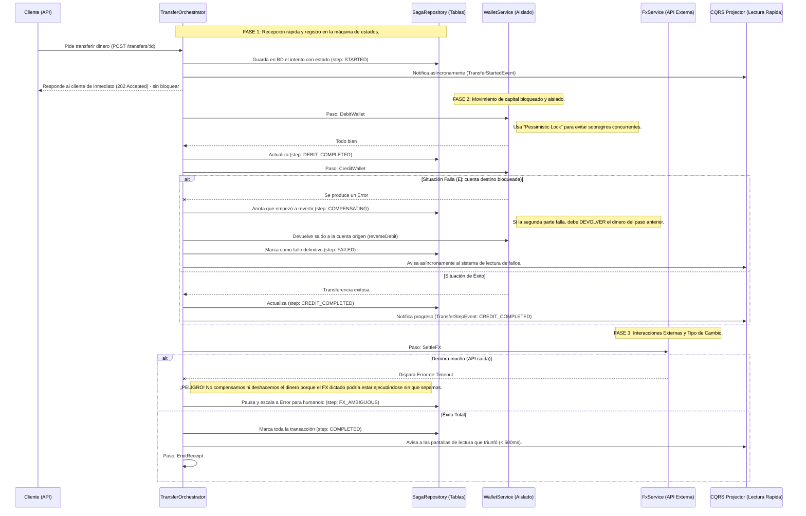

# Challenge 2: Wallet Transfer con Distributed Saga

He diseñado esta solución con un enfoque prioritario en la integridad y trazabilidad de las transferencias financieras, utilizando una **arquitectura basada en Orquestación de Sagas**, **CQRS acoplado a eventos** y técnicas de **Pessimistic y Optimistic Locking**. Mi objetivo fue abstraer la complejidad del manejo de errores parciales de los servicios core y evitar por todos los medios las transacciones distribuidas.

---

## Arquitectura y Flujo de la Solución

El siguiente diagrama ilustra cómo el Orquestador y la State Machine manejan el ciclo de vida de la transacción entre los diferentes dominios, asegurando consistencia eventual y escalabilidad.



## Explicación Paso a Paso del Diagrama:

**¿Por qué está este flujo diseñado así?** 
El Reto 2 prohíbe empujar todas estas acciones dentro de un mismo "bloque mágico de base de datos" llamado *transacciones distribuidas*. Por ende, usamos el patrón "Orquestador" (un gran director de orquesta) para ir paso por paso almacenando en memoria qué ha ocurrido.

* **Fase 1 (Inicio):** El usuario pide lanzar la transferencia. Para tener gran velocidad, no procesamos la petición bloqueándolo a la espera (imagina si mandaran un millón). En cambio, la recibimos, la anotamos en nuestra libreta de "Sagas" (`SagaRepository`) con estado `STARTED` y le devolvemos al usuario que el trámite "ya empezó". Todo lo subsiguiente corre de fondo.
* **Fase 2 (Sacar/Meter Dinero):** Aquí empieza lo crítico. El orquestador le dice al servicio de billetera "resta dinero al origen" y anota que lo hizo. Luego dice "suma el dinero al destino". 
  * Si da un error, interviene la directriz **Compensación**: El orquestador nota el tropiezo y dice *"Oye, ya le saqué el dinero al origen pero el destino cayó. Tienes que devolver el dinero prestado"*. Por lo que ordena ejecutar una reversión de dinero al primer cliente. Así el sistema no se roba la plata de nadie.
  * *¿Y si cien personas piden sacar plata a la vez?* Le colocamos a la billetera un `Lock` ("Candado"). Hasta que el Orquestador no termine de restar tu plata, cualquier otra persona haciendo click esperará en fila milisegundos, impidiendo que quedes en números negativos.
* **Fase 3 (Bonus: Estado Ambiguo de Red):** Por último, pedimos convertir divisas. Este servicio viaja por todo internet e interactúa con un banco. Si nos demoramos mucho, se lanza un `Timeout`. Frente a no saber si el otro prestamista hizo nuestra orden o no, no podemos deshacer todos los pasos, nos obligamos a pasar a un estado "limbo" para conciliación humana (`FX_AMBIGUOUS`). Si tiene éxito, todo se firma como `COMPLETED`. Mando mis avisos asíncronos y mi módulo `CQRS` reacciona casi sin impacto en RAM entregándole actualizaciones limpias al panel de usuarios finales en menos de 500ms.

#### Anatomía Interna de la Solución (Tablas, Servicios y Patrones)

Para materializar este diagrama sin violar las normas de Microservicios, se estructuró de la siguiente forma:

1. **Gestión de Tablas Físicas Separadas:**
   Se crearon estrictamente **5 tablas separadas** simulando fronteras de dominio. No se cruzan datos ni transacciones entre ellas:
   * **Core de Saga:** `transfer_sagas` (manejada exclusivamente por su Data Layer: el `SagaRepository`).
   * **Core Finanzas:** `wallets` (registra saldo y versiones), `debit_records` (asegura idempotencia de cobros), `reversal_records` (asegura idempotencia en el flujo inverso de fallos). Estas son dominadas por el **`WalletService`**, que es el cerebro de negocios y dueño exclusivo de los candados, no es una tabla en sí.
   * **Core Lectura:** `transfer_read_model`.
2. **Implementación Asíncrona Externa (`FxService`):**
   No utiliza tablas sino que simula la latencia de una red inestable o de terceros usando promesas internas. Contiene un inyector de error intencional: si lee la palabra `"timeout"` en un Request, tumba la conexión forzando la evaluación del estado **Ambiguo** de la Fase 3 del diagrama.
3. **CQRS y su Projector (`transfer-read-model.projector.ts`):** 
   CQRS dicta que la tabla donde las Sagas anotan sea intocable por los clientes visuales. 
   Por ello se implementó el **Patrón "Projector" (Periodista Pasivo)**: usando EventEmitter de NestJS, el `TransferOrchestrator` lanza un "grito" al aire (Eventos como *Started* o *Failed*) cada vez que concluye. El Projector intercepta esos ecos en segundo plano y aplana/copia un resumen inofensivo a nuestra 5ta tabla llamada `transfer_read_model`. Cuando el cliente pregunta a la API su estatus (GET), consumimos solo esa tabla optimizada permitiéndonos despachar datos consistentemente en un margen sub-500ms sin tocar zonas de riesgo mutacional.

---

## Cómo poner en marcha mi solución

He configurado la aplicación para inicializar tanto la base de datos PostgreSQL como la API NestJS automáticamente.

```bash
# 1. Levantar la infraestructura
docker-compose up -d

# 2. Instalar y arrancar
npm install
npm run start

# 3. Sembrar billeteras de prueba (ID: W-A y W-B)
curl -X POST http://localhost:3003/wallets/seed
```
*(TypeORM se encarga vía `synchronize: true` de crear el schema ideal para revisión local)*

---

## Escenarios de Validación

A continuación se detallan las pruebas para validar los requerimientos técnicos del desafío:

### 1. Orquestador de transferencias y CQRS
> **Requerimiento:** Implementar un `TransferOrchestrator` con el flujo `DebitWallet` → `CreditWallet` → `SettleFX` → `EmitReceipt` y un modelo de lectura `TransferReadModel` (< 500ms).

1. **Inicia la transferencia** de 100 USD:
   ```bash
   curl -X POST http://localhost:3003/transfers/T-001 -H "Content-Type: application/json" -d '{"fromWalletId": "W-A", "toWalletId": "W-B", "amount": 100, "fromCurrency":"USD", "toCurrency":"USD"}'
   ```
2. **Consulta el modelo de lectura** (CQRS) de inmediato:
   ```bash
   curl http://localhost:3003/transfers/T-001
   ```
   **Resultado:** El estado debe ser `completed` y la respuesta debe ser inmediata (< 500ms).
3. **Valida los saldos finales** (W-A: 900, W-B: 100):
   ```bash
   curl http://localhost:3003/wallets
   ```

---

### 2. Compensación en caso de fallo (ReverseDebit)
> **Requerimiento:** Si `CreditWallet` falla después de que `DebitWallet` tenga éxito, el orquestador debe emitir un evento de compensación `ReverseDebit`.

1. **Fuerza un fallo** intentando transferir a una billetera inexistente (`W-Z`):
   ```bash
   curl -X POST http://localhost:3003/transfers/T-fail-1 -H "Content-Type: application/json" -d '{"fromWalletId": "W-A", "toWalletId": "W-Z", "amount": 50, "fromCurrency":"USD", "toCurrency":"USD"}'
   ```
2. **Verifica la reversión** en el modelo de lectura:
   ```bash
   curl http://localhost:3003/transfers/T-fail-1
   ```
   **Resultado:** `status: "failed"` y `failureReason: "Wallet not found"`.
3. **Confirma la integridad** del saldo (W-A recupera sus 50 USD):
   ```bash
   curl http://localhost:3003/wallets
   ```

---

### 3. Seguridad ante concurrencia (Pessimistic Locking)
> **Requerimiento:** Si dos transferencias intentan debitar la misma wallet simultáneamente, el sistema debe encolar o fallar de forma segura. Un saldo negativo nunca es aceptable.

1. **Lanza 10 peticiones paralelas** (Bash) que exceden el saldo disponible:
   ```bash
   for i in {1..10}; do
     curl -X POST http://localhost:3003/transfers/T-CONC-$i \
       -H "Content-Type: application/json" \
       -d '{"fromWalletId": "W-A", "toWalletId": "W-B", "amount": 150, "fromCurrency":"USD", "toCurrency":"USD"}' &
   done
   ```
2. **Resultado esperado:** Debido al `SELECT FOR UPDATE` en `WalletService`, las peticiones se procesan en orden. Las primeras 6 agotan el saldo y la 7ma falla con `Insufficient funds`. **W-A** jamás bajará de 0.

---

### 4. Ampliación opcional: FX State Ambiguo (Timeout)
> **Requerimiento:** Manejar un timeout en la API de FX que deje el estado ambiguo (ni confirmado ni rechazado) para evitar compensaciones erróneas.

1. **Simula un Timeout** de red (usando la palabra `timeout` en el ID):
   ```bash
   curl -X POST http://localhost:3003/transfers/T-timeout-1 -H "Content-Type: application/json" -d '{"fromWalletId": "W-A", "toWalletId": "W-B", "amount": 10, "fromCurrency":"USD", "toCurrency":"PEN"}'
   ```
2. **Verifica el estado de excepción:**
   ```bash
   curl http://localhost:3003/transfers/T-timeout-1
   ```
   **Resultado:** `status: "in_progress (FX_AMBIGUOUS)"`. Los fondos quedan reservados hasta intervención manual.

---

He diseñado esta orquestación tomando decisiones que priorizan control y mitigación de fallos sobre un simple MVP:

### Orquestación vs Coreografía (ADR)
Elegí **Orquestación (State Machine Manual + Repo)** por sobre Coreografía Purificada.
1. **Estado centralizado (Explícito):** En finanzas, Coreografía significa tener a Servicios "A", "B" y "C" escupiendo eventos sin nadie al volante. En caso de disputa, Support tiene que rastrear 4 tópicos Kafka. En mi solución, consultar la tabla `transfer_sagas` otorga trazabilidad milimétrica (`"FAILED in CREDIT_COMPLETED"`).
2. **Ciclo de vida central:** Me permite inyectar compensaciones de manera asíncrona pero coordinada y determinista.
3. Lo negativo (SPOF) se mitiga con alta disponibilidad en la DB y reinicios asíncronos en los workers que puedan seguir iterando Sagas incompletas.

### CQRS Asíncrono
1. Nunca consulto la DB de Sagas para servir el endpoint GET Client-facing. Este obtiene data de la tabla `transfer_read_model` actualizada pasivamente en milisegundos usando eventos (NestJS Event Emitter, que en un ambiente mayor sería Kafka consumers).

### Prácticas Evitadas
*   **Transacciones Distribuidas Mágicas:** Evito `@Transaction()` que cruce los repositorios de `Wallet` y `TransferSaga`, adhiriéndome a las buenas prácticas de Boundary Types.

---

## Cumplimiento de Entregables

| Entregable | Estado | Ubicación | Justificación |
| :--- | :---: | :--- | :--- |
| **1. Orquestador de transferencias** <br> Implementa un `TransferOrchestrator` que ejecute los siguientes pasos en orden: <br> `DebitWallet` → `CreditWallet` → `SettleFX` → `EmitReceipt` <br> *(Justificación técnica incluida en la sección ADR abajo)* | ✅ | `transfer.orchestrator.ts` coordina la máquina de estado. | Se optó por una máquina de estados almacenada en base de datos (Orquestación artesanal) para garantizar trazabilidad exacta, permitiendo reintentos granulares y control total sobre fallos externos. |
| **2. Compensación en caso de fallo** | ✅ | Emisión estructurada (en `transfer.orchestrator.ts` llamando a `reverseDebit()`). | Evita saldos fantasmas asegurando que la reversión sea idempotente y explícita frente a un fallo del sistema remoto (CreditWallet). |
| **3. Modelo de lectura CQRS** | ✅ | EventEmitter en `transfer-read-model.projector.ts` para separar lecturas. | Garantiza tiempos de respuesta de consulta menores a 500ms al no tener que interrogar las tablas transaccionales bloqueadas. |
| **4. Seguridad ante concurrencia** | ✅ | `SELECT FOR UPDATE` (`pessimistic_write`) y versionado en `wallet.service.ts`. | Previene que dos peticiones simultáneas consuman el mismo saldo evitando los clásicos descuidos que provocan cuentas en negativo. |
| **5. Evasión de Antipatrón Descalificador** | ✅ | Todo el código. Reversiones asíncronas entre métodos aislados. | **NO existe** una sola transacción distribuida en BD que abarque débitos y créditos a la vez. Cada operación tiene su propio `QueryRunner` aislado, confiando el éxito a las Sagas y a la consistencia eventual. |
| **6. Ampliación Opcional (FX Timeout)** | ✅ | Simulación en `fx.service.ts` y pausa en `transfer.orchestrator.ts`. | Se intercepta un timeout simulado pausando la saga en estado `FX_AMBIGUOUS`, obligando a revisión manual y probando que un timeout sin confirmar no dispara compensaciones. |
