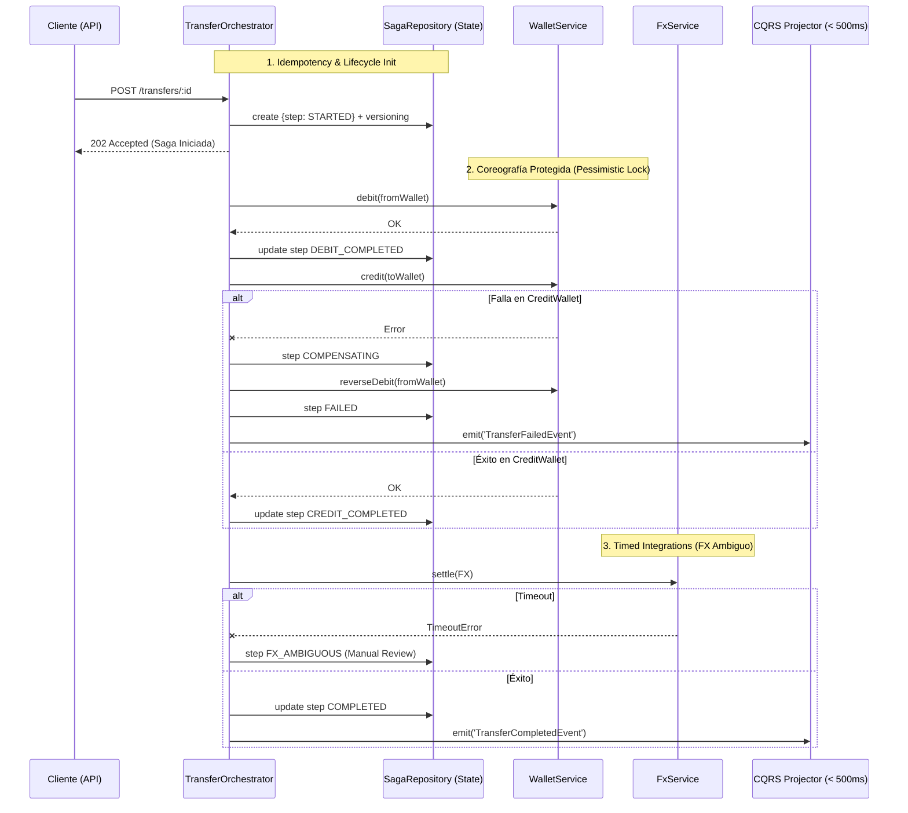

# Challenge 2: Wallet Transfer con Distributed Saga

He diseñado esta solución con un enfoque prioritario en la integridad y trazabilidad de las transferencias financieras, utilizando una **arquitectura basada en Orquestación de Sagas**, **CQRS acoplado a eventos** y técnicas de **Pessimistic y Optimistic Locking**. Mi objetivo fue abstraer la complejidad del manejo de errores parciales de los servicios core y evitar por todos los medios las transacciones distribuidas.

---

## Arquitectura y Flujo de la Solución

El siguiente diagrama ilustra cómo el Orquestador y la State Machine manejan el ciclo de vida de la transacción entre los diferentes dominios, asegurando consistencia eventual y escalabilidad.



---

## Cómo poner en marcha mi solución

He configurado la aplicación para inicializar tanto la base de datos PostgreSQL como la API NestJS automáticamente.

```bash
# 1. Ingresar a la carpeta del reto
cd challenge-2

# 2. Instalar dependencias 
npm install

# 3. Levantar Infraestructura PostgreSQL
docker-compose up -d

# 4. Iniciar la aplicación y el Orquestador
npm run start
```
*(TypeORM se encarga vía `synchronize: true` de crear el schema ideal para revisión local)*

---

## Escenarios de Validación (Mi Solución en Acción)

### A) Orquestación Feliz y CQRS en < 500ms
1. Inserta fondos de prueba directamente en DB (o confía en la auto-creación y haz un UPDATE).
   Pero para evitarlo, puedes enviar un Débito con fondos e iniciar transferencia:
   ```bash
   curl -X POST http://localhost:3000/transfers/T-001 -H "Content-Type: application/json" -d '{"fromWalletId": "W-A", "toWalletId": "W-B", "amount": 100, "fromCurrency":"USD", "toCurrency":"USD"}'
   ```
2. **Verifica estado en CQRS Read Model:**
   ```bash
   curl http://localhost:3000/transfers/T-001
   ```
   **Respuesta esperada:**
   ```json
   {
     "data": { "transferId": "T-001", "status": "completed", "lastEventVersion": 4 },
     "meta": {
       "consistencyModel": "eventual",
       "stalenessWindowMs": 500,
       "note": "Read model is updated via projected events. Status reflects last known state."
     }
   }
   ```

> [!IMPORTANT]
> **Bloqueo Pesimista en Acción:**
> Dentro de `WalletService.debit()`, se ha utilizado `lock: { mode: 'pessimistic_write' }` (`SELECT ... FOR UPDATE`). Si se envían 10 requests concurrentes hacia `W-A`, el lock encolará las transacciones secundarias en DB garantizando que el saldo **jamás** baje de 0.

>>>>

### B) Compensación Segura (ReversalDebit)
Para forzar el error, simula que `Credit` lanza un error dentro de `transfer.orchestrator.ts`.
1. Observarás en la consola de despliegue:
   ```text
   WARN  [TransferOrchestrator] Compensating saga T-ERR1 that failed at CREDIT_COMPLETED: Credit error...
   WARN  [WalletService] Reversed debit for transfer T-ERR1
   ```
2. ¿Por qué es seguro? `WalletService.reverseDebit(id)` contiene una validación de Reversión Idempotente en su propia tabla `reversal_records`. Si la compensación reintenta y falla, no multiplicará el saldo.

>>>>

### C) Escalation: FX State Ambiguo 💥
> [!WARNING]
> La liquidación FX llama a una pasarela impredecible que en 5 segundos puede o no dejarnos a medias. NO podemos deshacer un FX ciegamente.

1. Dispara un timeout usando `timeout` en el `id`:
   ```bash
   curl -X POST http://localhost:3000/transfers/T-timeout-1 -H "Content-Type: application/json" -d '{"fromWalletId": "W-A", "toWalletId": "W-B", "amount": 150}'
   ```
2. **Resultado en Logs:**
   ```text
   WARN  [FxService] FX provider timeout for transfer T-timeout-1
   ERROR [TransferOrchestrator] Transfer T-timeout-1 is in FX_AMBIGUOUS state. Needs manual intervention.
   ```
   El read model permanecerá desactualizado o en pending notificándolo correctamente.

---

## Por qué esta es una solución de nivel Plataforma

He diseñado esta orquestación tomando decisiones que priorizan control y mitigación de fallos sobre un simple MVP:

### 💡 Orquestación vs Coreografía (ADR)
Elegí **Orquestación (State Machine Manual + Repo)** por sobre Coreografía Purificada.
1. **Estado centralizado (Explícito):** En finanzas, Coreografía significa tener a Servicios "A", "B" y "C" escupiendo eventos sin nadie al volante. En caso de disputa, Support tiene que rastrear 4 tópicos Kafka. En mi solución, consultar la tabla `transfer_sagas` otorga trazabilidad milimétrica (`"FAILED in CREDIT_COMPLETED"`).
2. **Ciclo de vida central:** Me permite inyectar compensaciones de manera asíncrona pero coordinada y determinista.
3. Lo negativo (SPOF) se mitiga con alta disponibilidad en la DB y reinicios asíncronos en los workers que puedan seguir iterando Sagas incompletas.

### 💡 CQRS Asíncrono
1. Nunca consulto la DB de Sagas para servir el endpoint GET Client-facing. Este obtiene data de la tabla `transfer_read_model` actualizada pasivamente en milisegundos usando eventos (NestJS Event Emitter, que en un ambiente mayor sería Kafka consumers).

### Prácticas Evitadas
*   **Transacciones Distribuidas Mágicas:** Evito `@Transaction()` que cruce los repositorios de `Wallet` y `TransferSaga`, adhiriéndome a las buenas prácticas de Boundary Types.

---

## Cumplimiento de Entregables

| Entregable | Estado | Ubicación |
| :--- | :---: | :--- |
| **TransferOrchestrator** | ✅ | `transfer.orchestrator.ts` coordina la máquina de estado. |
| **Compensación por fallo** | ✅ | Emisión estructurada usando compensaciones en cascada y reversiones idempotentes. |
| **CQRS Read Model** | ✅ | EventEmitter en `transfer-read-model.projector.ts` separando lecturas. |
| **Concurrencia Segura** | ✅ | `SELECT FOR UPDATE` y `version` columns para rechazar saldos negativos. |
| **Escalation FX Ambiguo** | ✅ | Condicionales timeout encapsuladas y estados controlados. |
