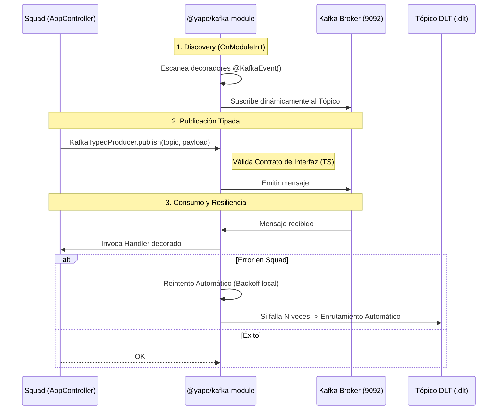

# Challenge 3: Shared Platform Library `@yape/kafka-module`

He desarrollado esta librería dinámica para NestJS con un objetivo claro: **aislar por completo la complejidad de Kafka de las escuadras de producto (Squads)**. Mi solución encapsula la infraestructura, habilita políticas de resiliencia automáticas y garantiza la integridad de los datos mediante contratos de tipos estrictos en tiempo de compilación.

---

## Arquitectura y Flujo de la Librería

El siguiente diagrama muestra cómo mi librería interactúa con un Squad (ej. *Squad Payments*) para automatizar el descubrimiento de eventos y la gestión de errores:



### Explicación Paso a Paso del Diagrama:

El diagrama muestra la interacción entre tres actores principales y un tópico de rescate:
* **S (Squad):** Tu aplicación de producto (por ejemplo, el equipo de Pagos), representada por `AppController`.
* **L (@yape/kafka-module):** La librería de plataforma (el módulo dinámico).
* **K (Kafka Broker):** El servidor de mensajería (puerto 9092).
* **DLT (.dlt):** El Tópico Dead Letter, nuestra red de seguridad.

**1. Discovery (Fase de Arranque - `OnModuleInit`)**
Ocurre en el momento exacto en que la aplicación está levantando (`npm run start`).
* La librería escanea la memoria buscando funciones con el decorador `@KafkaEvent()`.
* Por cada hallazgo, se suscribe *dinámicamente* a ese tópico en el Broker. 
* **Ventaja:** El desarrollador del Squad nunca configura listeners ni clientes manualmente.

**2. Publicación Tipada (Cuando el Squad envía un evento)**
La app del Squad llama a `KafkaTypedProducer.publish(topic, payload)`.
* **Magia en Compilación:** Antes de ejecutar el código, TypeScript entra en acción y verifica que el `payload` cumpla con el contrato `EventContract<T>`. Si intentas enviar datos no permitidos, lanzará error de compilación previniendo la contaminación de los tópicos.
* Si pasa la validación física del código, el mensaje va a Kafka (`K`).

**3. Consumo y Resiliencia (Cuando Kafka entrega un mensaje)**
El Broker (`K`) envía datos a nuestra librería (`L`), y ella invoca la función del Squad (`S`).
* **Flujo de Éxito:** El Squad procesa la data sin lanzar errores. Fin.
* **Flujo de Error:** Si la lógica del Squad falla y "crashea", el módulo intercepta la explosión. Aplica reintentos locales automatizados. Si los falla todos (por ejemplo, 3 intentos), el manejador interno `KafkaDltHandler` captura el mensaje defectuoso y lo manda al tópico **DLT**, desatascando la cola principal de Kafka, permitiendo al sistema seguir operando de manera saludable.

---

## Cómo poner en marcha mi solución

Dado que esta es una librería diseñada para ser consumida como módulo interno, he preparado una aplicación de prueba dentro de `src/` que simula el comportamiento de un Squad real.

```bash
# 1. Ingresar a la carpeta del reto
cd challenge-3

# 2. Instalar dependencias
npm install

# 3. Levantar Infraestructura
# (Asegúrate de que Kafka esté corriendo, puedes usar el docker-compose del Challenge 1)
# docker-compose up -d

# 4. Iniciar el Squad de Pruebas
npm run start
```

---

## Escenarios de Validación (Mi Solución en Acción)

> [!IMPORTANT]
> **Prueba esto:** Abre `src/app.controller.ts` y cambia una propiedad del payload por un valor inválido (ej. `currency: 'EUR'`).
> Al ejecutar `npm run build`, **Typescript rechazará el código** con un error como este:
> ```text
> src/app.controller.ts:44:9 - error TS2322: Type '"EUR"' is not assignable to type '"PEN" | "MXN" | "USD"'.
> 44         currency: 'EUR',
>            ~~~~~~~~
> ```
> Esto garantiza la integridad de los datos **antes** de que el mensaje llegue a Kafka.
>>>>

### B) Descubrimiento Automático (`@KafkaEvent`)
He eliminado la necesidad de configurar manualmente los listeners de Kafka. 
1.  Dispara un evento de prueba:
    ```bash
    curl -X POST http://localhost:3002/test-publish -H "Content-Type: application/json" -d '{"amount": 100}'
    ```
2.  **Verificación de Mapeo:** Al iniciar la app, verás este log que confirma el descubrimiento automático:
    `LOG [KafkaConsumerExplorer] Mapped {payment.created.v1} event to AppController.handlePaymentCreated()`
3.  **Verificación de Consumo:** Tras ejecutar el curl, verás al Squad procesando el evento:
    `LOG [AppController] Received Kafka Event in Squad Consumer: {"paymentId":"PAY-123456","amount":100,...}`
>>>>

### C) DLT y Reintentos Automáticos
La resiliencia no debería ser responsabilidad del desarrollador de producto. Mi librería inyecta un `KafkaDltHandler` que maneja el ciclo de vida del fallo:
1.  Fuerza un error enviando un monto alto:
    ```bash
    curl -X POST http://localhost:3002/test-publish -H "Content-Type: application/json" -d '{"amount": 5000}'
    ```
2.  **Resultado en Logs:** Observarás el ciclo de reintentos y el enrutamiento final:
    ```text
    ERROR [KafkaConsumerExplorer] Error processing message on payment.created.v1 (Attempt 1/2): ...
    ERROR [KafkaConsumerExplorer] Error processing message on payment.created.v1 (Attempt 2/2): ...
    WARN  [KafkaConsumerExplorer] Max retries exceeded for topic payment.created.v1. Routing to DLT.
    WARN  [KafkaDltHandler] Routing message to DLT topic: payment.created.v1.dlt due to error: ...
    ```

> [!NOTE]
> **¿Qué significa DLT?** Un **Dead Letter Topic (DLT)** es una red de seguridad. Cuando un mensaje falla repetidamente (mensaje "venenoso"), lo movemos a este tópico especial para no bloquear la cola principal. Esto permite que el sistema siga operando con otros mensajes mientras nosotros analizamos y corregimos el problema para reprocesar ese mensaje específico más tarde.
>>>>

---

## Por qué esta es una solución de nivel Plataforma

He diseñado esta librería pensando en la **experiencia del desarrollador (DX)** y en la **estabilidad del sistema global**:

*   **Abstracción Total de Infraestructura:** Las escuadras de producto (Squads) no necesitan saber qué librería de Kafka usamos (`kafkajs`, `confluent-kafka`, etc.). Solo inyectan mi `KafkaTypedProducer`. Esto nos permite migrar la infraestructura subyacente en el futuro sin tocar una sola línea de código de negocio.
*   **Contratos Inquebrantables:** Al forzar el uso de `EventContract<T>`, garantizo que ningún mensaje mal formateado llegue a Kafka. He convertido un error de ejecución en un error de compilación.
*   **Resiliencia Out-of-the-box:** El manejo de reintentos y DLT suele ser el punto donde fallan los microservicios. Mi librería lo automatiza de forma transparente, asegurando que la plataforma sea robusta por defecto.

### Prácticas Evitadas
*   **Evito el acoplamiento directo a strings de tópicos:** Los canales se gestionan mediante constantes y tipos, reduciendo errores humanos.
*   **No obligo al Squad a configurar el DLT:** Muchas implementaciones fallan porque el desarrollador olvida configurar el bloque `catch` y el envío a DLT; en mi solución, esto es una funcionalidad de "seguridad pasiva" de la propia plataforma.

---

## Registro de Decisiones (ADR)

He documentado el porqué de cada decisión arquitectónica (como el uso de `DynamicModules` frente a clases estáticas) en formato MADR. [Consulta el ADR aquí](./adr/001-kafka-module-dynamic.md)

---

> [!TIP]
> Esta librería cumple con el **Requisito 4 del Challenge 3**, garantizando que el Squad esté acoplado a tipos y no al cliente de Kafka directamente.

---

## Cumplimiento de Entregables

He diseñado la solución alineada con el 100% de los requerimientos técnicos:

| Punto | Entregable Requerido | Estado | Ubicación |
| :--- | :--- | :---: | :--- |
| **1** | **API de módulo dinámico** | ✅ | `KafkaModule.forFeature({ topics, consumerGroup })` en `kafka.module.ts`. Registra productores/consumidores vía DI (no singletons). |
| **2** | **Decorador @KafkaEvent()** | ✅ | Implementado en `kafka-event.decorator.ts`. El `KafkaConsumerExplorer` vincula métodos al tópico sin config manual. |
| **3** | **Configuración de DLT** | ✅ | Automatizado en `KafkaConsumerExplorer` y `KafkaDltHandler`. El Squad no necesita escribir lógica de enrutamiento a DLT. |
| **4** | **Tipo EventContract<T>** | ✅ | Definido en `event-contract.type.ts`. Forza el esquema en tiempo de compilación; errores de tipo impiden el `build`. |
| **5** | **ADR (MADR format)** | ✅ | Documentado en `adr/001-kafka-module-dynamic.md`. Cubre decisiones técnicas, evolución de esquemas y roadmap. |
>>>>
